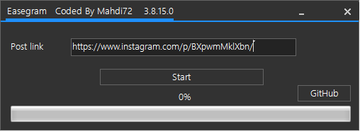

# Easegram

<b>Update 2017/08/15 New Servers Added App Work Perfectlly</b>
 Desktop Application for Increase Instagram post likes, based on priv8 Alghorithm publiced by Iranian forum.
https://forum.soft98.ir/showthread.php?t=80623  
Easegram, Easy on Instagram. Get rest and catch unlimited likes on your posts.

# Used Language
Written in C# and Visual Studio 2017.

# Features
Decode Instagram posts html code and extract PostId & UserId
get Unlimmited like on your instagram posts
Completly Free and Open Source
AsyncTask and Fast
It takes at least 10-20 minutes (its Normal because take real likes)
and more...

# Download
You can download the program (prebuilt executables and source snapshots) [via the releases tab](https://github.com/ghost1372/Easegram/releases).

## Contribute

If you would like to contribute, everyone is welcome to! If you are considering a major feature, need guidance, 
or want to talk an idea out

# Note
your Account must be public if your account is private, you must change it to public until this app work!
